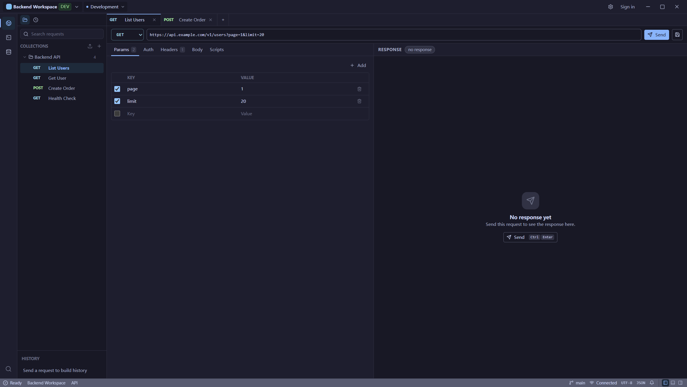
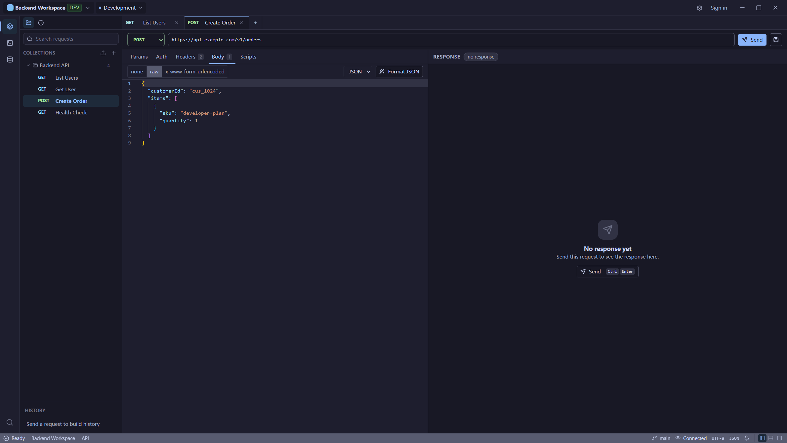
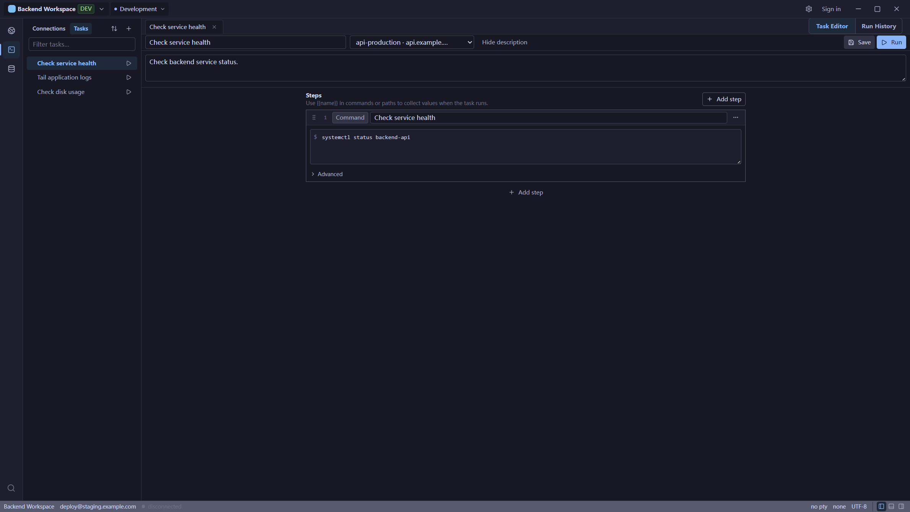
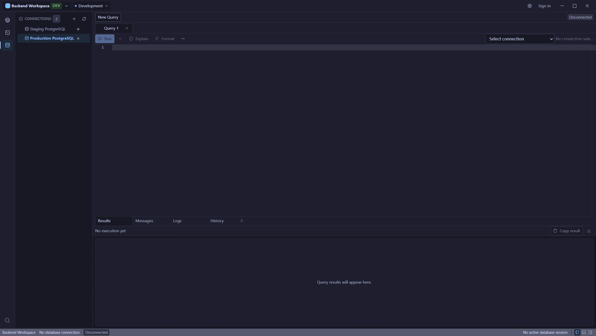

<div align="center">

[English](README.md) · [简体中文](README.zh-CN.md)

# Unfour

**A unified, local-first developer workspace for tracing backend failures from API requests through server logs and database state to verified fixes.**

Unfour brings API testing, SSH, database tools, local Flow runbooks, and MCP-assisted troubleshooting into one desktop application.

[](LICENSE)
[](https://github.com/zyqzyq/Unfour/actions/workflows/ci.yml)
[](https://github.com/zyqzyq/Unfour/releases)
[](https://tauri.app)



</div>

> [!WARNING]
> Unfour v0.11.0 was released on 2026-10-10. Windows NSIS
> installers are unsigned and may trigger SmartScreen or other operating-system
> security warnings. Use `SHA256SUMS.txt` from the GitHub Release to verify
> downloaded files.

See the [v0.11.0 changelog](CHANGELOG.md#0110---2026-10-10),
[Release Notes](docs/release/v0.11.0-release-notes.md), and
[final release verification](docs/testing/release-verification.md#v0110-final-release-verification-record).

## Download

Download the [latest Unfour release](https://github.com/zyqzyq/Unfour/releases/latest)
from GitHub Releases.

- Windows is the primary distribution path: NSIS `.exe` installer. It is
  unsigned and may trigger SmartScreen.
- macOS has Apple Silicon and Intel packages; real-device install/run
  verification was recorded for v0.9.0. They are not Apple-signed or notarized;
  Gatekeeper may block them.
- Linux publishes an x86_64 (x64) AppImage only. It is Experimental and currently
  targets Ubuntu 22.04+; Ubuntu 20.04 is not supported. The published v0.9.0
  AppImage predates this build baseline; new-artifact runtime verification is
  still pending. `.deb` and `.rpm` packages are not formally supported or
  published.
- Verify downloaded installers with the release `SHA256SUMS.txt` asset.

## What Is Unfour?

Unfour helps backend developers investigate failures that span an API, a
server, and its database. Troubleshooting is Unfour's core product loop:
reproduce an issue with an API request, inspect server logs over SSH, check
database state, identify the cause, and make and verify a fix.

A unified, local-first workspace keeps requests, connections, local activity,
and layout together throughout the investigation. API testing, SSH terminals,
and database tools provide the capabilities for each step in that loop. Flow
combines those capabilities into local runbooks for repeatable checks and tasks.
Flow V1 is local-only: its definitions and run history are not included in Cloud
Sync. It is a runbook tool for this workspace, not a general workflow platform.

MCP is an optional assisted layer: Codex and Cursor can use the local stdio
MCP server to work with the same saved API, SSH, and database connections as
the desktop app. Its workspace-scoped tools run through the shared command
bus, subject to MCP policy and high-risk action confirmation checks.
MCP can also start and cancel Flow runs and inspect their history.
Troubleshooting remains user-directed: you author and start runbooks, while
Unfour does not automatically correlate requests, logs, and database state or
detect root causes.

Unfour is one application and one product. Its core desktop features are free
and open source under Apache-2.0. An active Pro subscription unlocks Cloud Sync
in the same application. Pro is an entitlement within Unfour, not a separate
client, package, repository, or release.

The app is built with Tauri 2, React, TypeScript, and Rust. The frontend owns
the workbench UI, while security-sensitive execution such as HTTP, SSH,
database drivers, local storage, and credential references lives behind Rust
capability crates and the command bus.

## Troubleshooting Workflow

```text
API error
↓
Inspect server logs over SSH
↓
Check related database state
↓
Identify the cause
↓
Repeat the request and verify the fix
```

The investigation stays in one workspace, while you remain in control of each
request, SSH session, query, and verification step.

## For Coding Agents

Codex or Cursor can use their own repository tools to inspect, change, and test
code. Unfour complements those tools with controlled access to API behavior,
SSH/server evidence, and database state through MCP, so the agent can help
investigate the running backend and re-check it after a change.

Unfour does not edit the repository itself: the coding client owns code changes,
while Unfour provides the runtime side of the investigation. You control the
workspace, environment, risky actions, and final decision.

## Modules

- **API Client** - Compose and send HTTP requests, organize saved requests into
  collections and folders, resolve shared workspace variables, inspect response
  body/headers/cookies/timing, run saved pre-request and post-response scripts,
  review script tests and console output, keep redacted history, and import or
  export collections and environments.
- **SSH Terminal** - Manage SSH connections and terminal sessions (split panes,
  search, clipboard context menu, persistent redacted command history and
  typing suggestions, host-key trust, redacted logs), browse and
  transfer remote files over SFTP, and automate multi-step SSH tasks (command,
  upload, download) from the Connections / Files / Tasks sidebar.
- **Database** - Manage database connections, browse schemas, run SQL with
  confirmation-aware safety checks (including multi-statement Run All /
  Run Selected), preview and edit table rows, review query output, and export
  table structure as SQL and data as SQL, CSV, or JSON.
- **Flow** - Compose saved API requests, SSH tasks, and Database queries into
  local runbooks with Condition branches and Wait Until checks. Author them on
  the Canvas and inspect step results and run history. Flow V1 is local-only
  and does not support Cloud Sync.
- **Workspace** - Scope saved requests, shared environments/variables,
  connections, activity, tabs, and layout state to a local workspace, with
  title-bar active-environment switching. Export/import whole Workspace
  definitions or create a password-encrypted local backup with optional saved
  credentials. Import previews create independent copies. See
  [Workspace exchange and backups](docs/user/USER_GUIDE.md#workspace-exchange-and-local-backups).
- **MCP integration for Codex and Cursor** - Expose safe local stdio diagnostic
  tools through the same command bus used by the desktop app. Codex and Cursor
  can use the same saved API, SSH, and database connections to reproduce
  issues, inspect logs and database state, verify a fix, and manage or run local
  Flow runbooks with the same safety checks and shared run history.

> [Connect Codex and Cursor to Unfour MCP →](docs/mcp/client-setup.md)

Encrypted backups are local files, separate from Pro Cloud Sync. Sensitive data
is not synchronized to the cloud in v0.11.0; Flow definitions/history also stay
local. Backups do not embed database/private-key files or history. Review free-form
scripts and SQL before sharing a definitions export.

## Screenshots

**App overview — sidebar with module switcher and the API Client workspace**


**API Client — request builder with params, auth, headers, body, and response**



**SSH Terminal — connections, sessions, remote files, and tasks**



**Database — schema browsing and SQL query output**



## Local Development

Requirements:

- Node.js and pnpm.
- A stable Rust toolchain.
- Tauri 2 prerequisites for your operating system.

Install and run:

```bash
pnpm install
pnpm tauri dev
```

`pnpm install` also installs Git hooks through lefthook. A commit formats staged
Rust files with `cargo fmt` and auto-fixes staged TypeScript with ESLint.
Skip once with `LEFTHOOK=0 git commit`.

Common commands:

```bash
pnpm tauri build        # create local Stable-channel Tauri bundles
pnpm tauri build:test   # create isolated Test-channel Tauri bundles
pnpm run build          # build the desktop frontend only
pnpm run check          # frontend build + Rust check + large-file check
pnpm run lint           # ESLint
pnpm run test           # frontend unit tests (Vitest)
pnpm run test:e2e       # Playwright smoke tests
pnpm run check:rust     # cargo check --workspace
pnpm run check:rust:ssh # cargo check with the ssh-native feature
pnpm run test:rust      # cargo test --workspace
pnpm run test:release-env # release/channel contract unit tests
```

Run commands from the repository root unless a package document says otherwise.
`pnpm tauri dev` defaults to the Test release channel, while local
`pnpm tauri build` defaults to Stable. Use `pnpm tauri build:test` for an
isolated Test-channel bundle. Set `UNFOUR_STORAGE_PROFILE=dev` when development
data should use `~/.unfour-dev`; this storage override is independent from
release identity. Only CI should create formal publishable Stable artifacts,
with `UNFOUR_RELEASE_CHANNEL=stable` and an exact `UNFOUR_BUILD_COMMIT`.

## Project Layout

| Path | Role |
| --- | --- |
| `apps/desktop` | Tauri/Vite desktop app entry and Tauri adapter layer. |
| `packages/app-shell` | Global shell composition and module mount slots. |
| `packages/api-client` | API Client frontend module. |
| `packages/ssh-terminal` | SSH Terminal frontend module. |
| `packages/database` | Database frontend module. |
| `packages/flow` | Local Flow runbook editor, Canvas, and run history. |
| `packages/workspace-core` | Shared frontend workspace state. |
| `packages/workspace-environments` | Workspace environments and variables management UI. |
| `packages/workspace-local` | Reserved local workspace lifecycle boundary. |
| `packages/ui` | Shared UI primitives and stateless layout helpers. |
| `packages/command-client` | Typed Tauri command wrappers and frontend command types. |
| `crates/*` | Rust backend capability crates and adapters. |

See `docs/architecture/project-structure.md` for the full package and crate
map.

## Release Status

[Unfour v0.11.0](https://github.com/zyqzyq/Unfour/releases/tag/v0.11.0) was
published as a Standard stable release on 2026-10-10. CI, Standard Release
Candidate, Standard Release, published assets, checksums, and live updater/download
manifests are verified. Native platform, live-service, and manual regressions
without v0.11.0 evidence remain `NOT VERIFIED`. Earlier releases and v0.11.0
RC preparation records retain their historical scope.
Release verification evidence is documented in:

- `docs/testing/release-verification.md`
- `docs/testing/manual-test-cases.md`
- `docs/release/release-checklist.md`
- `docs/release/distribution.md`
- `docs/release/signing.md`

Windows is the primary distribution path and ships an unsigned NSIS `.exe`
installer that may trigger SmartScreen. macOS has Apple Silicon and Intel
packages, with real-device verification recorded for v0.9.0, but they are not
Apple-signed or notarized and Gatekeeper may block them. Linux publishes an
x86_64 (x64) AppImage only,
remains Experimental, and uses Ubuntu 22.04+ as its current runtime/test baseline.
Ubuntu 20.04 is not supported; compatibility with other distributions is not
guaranteed solely by their glibc version. `.deb` and `.rpm` packages are not
formally supported or published. Use the release `SHA256SUMS.txt` to verify
downloaded artifacts, and do not claim a release check passes unless it was run
successfully for the target platform or is backed by current repository evidence.

The published v0.9.0 Linux AppImage built successfully but failed to launch on
Ubuntu 20.04 because it requires Ubuntu 24.04-era GLIBC/GLIBCXX symbols. The
v0.11.0 AppImage was built on Ubuntu 22.04; the immutable v0.9.0 download
remains unchanged. v0.11.0 Ubuntu 22.04/24.04 runtime regression remains
`NOT VERIFIED` until installed-artifact testing is recorded; see
[release verification](docs/testing/release-verification.md#linux-appimage-compatibility).

Recorded v0.9.0 real-environment verification includes Windows install, launch,
uninstall, and a previous-Stable-to-new-Stable update; macOS arm64/x64 install
and run; GitHub browser OAuth and the Desktop callback/login; Creem Test
checkout, webhook, entitlement, and billing portal; PostgreSQL and MySQL; SSH
Terminal, SFTP, and SSH Tasks; and real Codex and Cursor MCP initialization,
tool discovery, tool calls, and access to Unfour data/tools.

Historical live multi-device Cloud Sync verification exists, but the v0.9.0
unified-client multi-device regression remains `NOT VERIFIED` and will include
single-device coverage. Creem Production will be recorded after the first real
production transaction flow. MCP production-policy behavior, Linux AppImage
runtime integration, real MSIX/Store servicing, and macOS Gatekeeper trust
behavior also remain `NOT VERIFIED`; these limits do not reduce the verified
platform install/run results above.

## Documentation

- `AGENTS.md` - repository rules for coding agents.
- `docs/agents/START_HERE.md` - scoped onboarding path for AI agents.
- `docs/architecture/package-boundaries.md` - package ownership and forbidden
  dependency directions.
- `docs/architecture/project-structure.md` - repository, package, crate, and
  call-chain map.
- `docs/architecture/data-storage.md` - workspace data, SQLite, credential
  references, and local activity rules.
- `docs/architecture/diagnostics.md` - local structured logs, redaction,
  retention, diagnostic bundles, and developer logging guidance.
- `docs/architecture/security-model.md` - security posture, redaction, host-key
  policy, and dangerous-action rules.
- `docs/mcp/overview.md` and `docs/mcp/tools.md` - local MCP server behavior.
- `docs/mcp/client-setup.md` - installed-user setup for Codex and Cursor.
- `docs/testing/release-verification.md` - release verification matrix.
- `docs/release/release-checklist.md` - public release checklist.
- `docs/user/USER_GUIDE.md` - user-facing workflow guide.

## Contributing

Please read `CONTRIBUTING.md`, `CODE_OF_CONDUCT.md`, and the package boundary
rules in `AGENTS.md` before opening a pull request.

Security issues should be reported through `SECURITY.md`, not a public issue.

## Support Unfour

If Unfour is useful to you, you can support its continued open-source development through [GitHub Sponsors](https://github.com/sponsors/zyqzyq).

Sponsorship is optional and does not include Unfour Pro or paid cloud services.

## Why Unfour?

The name “Unfour” is partly inspired by the Chinese idea of **四不像** — something that doesn’t quite fit into any single category.

Unfour isn’t just an API client, an SSH tool, a database client, or an agent workspace. It brings those usually separate capabilities together, so the name carries a bit of self-deprecating humor: it’s not quite any one of them, but has a little of each.

In traditional Chinese mythology, 四不像 is also associated with an auspicious mythical creature. That gave the name another meaning for me — a small hope that Unfour can grow into something a little unusual, but genuinely useful and built to last.

## License

Licensed under the [Apache License 2.0](LICENSE).
