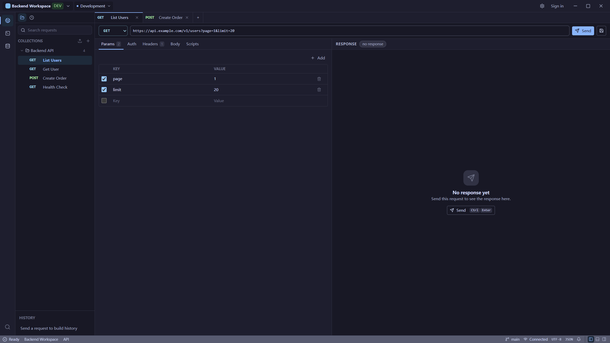
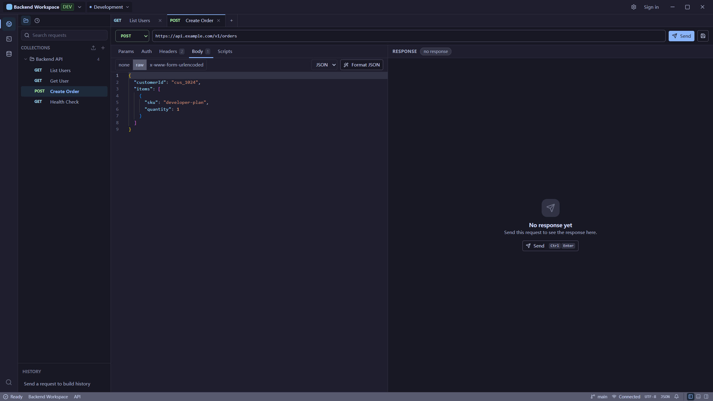
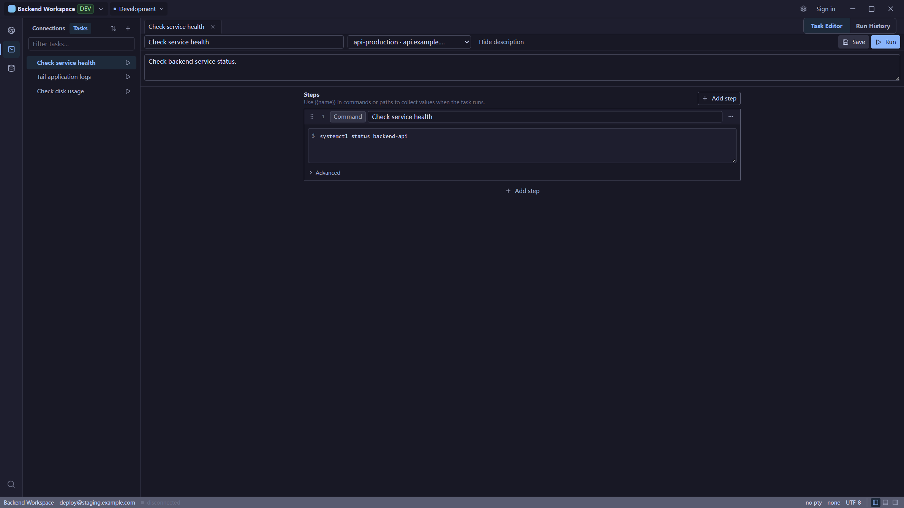
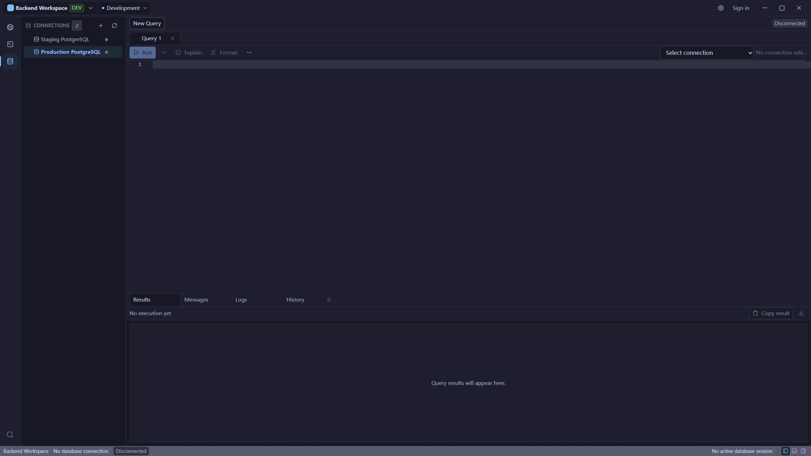

<div align="center">

[简体中文](README.zh-CN.md) · [English](README.md)

# Unfour

**一个面向后端开发者的本地优先桌面工作台，整合 API 调试、SSH 终端与数据库管理，并通过本地 MCP 服务把能力暴露给 Codex 与 Cursor。**

[](LICENSE)
[](https://github.com/zyqzyq/Unfour/actions/workflows/ci.yml)
[](https://github.com/zyqzyq/Unfour/releases)
[](https://tauri.app)



</div>

> [!WARNING]
> 当前已发布版本是 `v0.8.0`，定位为 Community release / Preview（社区发布 / 预览）。
> Windows NSIS 安装包尚未签名，可能触发 SmartScreen 或其他操作系统安全警告。
> 请使用 GitHub Release 中的 `SHA256SUMS.txt` 校验下载文件。

## 下载

请从 GitHub Releases 下载已发布的 [`v0.8.0`](https://github.com/zyqzyq/Unfour/releases/tag/v0.8.0)。

- Windows 是主分发路径：NSIS `.exe` 安装包。该安装包尚未签名，可能触发
  SmartScreen。
- macOS 提供 Apple Silicon 与 Intel 包，均已在真机验证，但未 Apple 签名、未公证；
  Gatekeeper 可能拦截。
- Linux 目前只发布 x64 AppImage，定位为 Experimental（实验性）；`.deb` 和
  `.rpm` 暂不正式支持，也不会公开发布。
- 使用 Release 中的 `SHA256SUMS.txt` 校验下载的安装包。

## Unfour 是什么？

Unfour 是一个面向后端与运维工作的本地优先桌面工作台。它把 API 请求、SSH 连接、
数据库连接、本地活动与工作台布局统一在一个本地优先的应用中，并通过本地 MCP 服务把这些
能力暴露给 Codex 与 Cursor。桌面工作台与本地 MCP 服务共用同一条命令总线，以及同一套已保存
的 API、SSH 与数据库连接，因此你可以和 Codex 或 Cursor 在同一排障闭环中复现问题、查日志、
查数据库状态，再进行修复。排障是 Unfour 的核心产品闭环。Unfour 不内置自动运行的排障剧本：
你与 Codex 或 Cursor 一起推进步骤，使用现成的诊断工具，而不是由 workflow runner 自动编排。

应用基于 Tauri 2、React、TypeScript 与 Rust 构建。前端负责工作台界面，而 HTTP、SSH、
数据库驱动、本地存储与凭据引用等安全敏感的执行逻辑，则位于 Rust 能力模块与命令总线之后。

## 模块

- **API Client（API 客户端）** - 编写并发送 HTTP 请求，将已保存的请求整理为集合与
  文件夹，解析共享工作区变量，检查响应体 / 请求头 / Cookie / 耗时，运行已保存的请求前与
  响应后脚本，查看脚本测试和控制台输出，并保留经过脱敏的历史记录。
- **SSH Terminal（SSH 终端）** - 管理 SSH 连接与终端会话（分屏、搜索、主机密钥信任、
  剪贴板右键菜单、持久化的脱敏命令历史与输入建议、脱敏日志），通过 SFTP 浏览与传输
  远程文件，并在 Connections / Files / Tasks 侧栏中编排多步骤 SSH 任务（命令、上传、下载）。
- **Database（数据库）** - 管理数据库连接，浏览 Schema，在带确认的安全检查下运行
  SQL（支持多语句 Run Current / Run All），预览与编辑表数据，并查看查询结果。
- **Workspace（工作区）** - 将已保存的请求、共享环境变量、连接、活动、标签页与布局状态
  限定在某个本地工作区之内，并支持标题栏切换当前环境。
- **MCP integration（面向 Codex 与 Cursor）** - 通过桌面应用所用的同一命令总线，
  以本地 stdio 方式提供安全的诊断工具。Codex 与 Cursor 可以使用同一套已保存的 API、
  SSH 与数据库连接来复现问题、查日志、查数据库状态并进行修复。使用者与 Codex 或 Cursor
  一起推进步骤；Unfour 不内置自动运行的排障剧本或 workflow runner。

> [连接 Codex 与 Cursor 到 Unfour MCP →](docs/mcp/client-setup.md)

## 截图

**应用总览 — 左侧模块切换栏与 API Client 工作台**


**API Client — 含 Params / Auth / Headers / Body 的请求构造器与响应区**



**SSH 终端 — 连接、会话、远程文件与任务**



**数据库 — Schema 浏览与 SQL 查询输出**



## 本地开发

环境要求：

- Node.js 与 pnpm。
- 稳定的 Rust 工具链。
- 对应操作系统的 Tauri 2 前置依赖。

安装与运行：

```bash
pnpm install
pnpm tauri dev
```

`pnpm install` 会通过 lefthook 安装 Git hooks。提交时会对暂存的 Rust 文件执行
`cargo fmt`，并对暂存的 TypeScript 执行 ESLint `--fix`。
如需跳过一次，使用 `LEFTHOOK=0 git commit`。

常用命令：

```bash
pnpm tauri build        # 生成使用 Stable 数据目录的 Tauri 安装包
pnpm tauri build:test   # 生成使用 Test 隔离数据目录的 Tauri 安装包
pnpm run build          # 仅构建桌面前端
pnpm run check          # 前端构建 + Rust 检查 + 大文件检查
pnpm run lint           # ESLint
pnpm run test           # 前端单元测试（Vitest）
pnpm run test:e2e       # Playwright 冒烟测试
pnpm run check:rust     # cargo check --workspace
pnpm run check:rust:ssh # 启用 ssh-native 特性的 cargo check
pnpm run test:rust      # cargo test --workspace
```

除非某个包的文档另有说明，否则请从仓库根目录运行上述命令。
`pnpm tauri dev` 默认使用 Test 通道，`pnpm tauri build` 默认使用 Stable 通道，
需要隔离数据的本地测试安装包请使用 `pnpm tauri build:test`。本地 Stable 构建不等于
经过 CI 验证的正式发布产物；正式发布仍须显式提供 `UNFOUR_RELEASE_CHANNEL=stable`
和准确的 `UNFOUR_BUILD_COMMIT`。

## 项目结构

| 路径 | 职责 |
| --- | --- |
| `apps/desktop` | Tauri/Vite 桌面应用入口与 Tauri 适配层。 |
| `packages/app-shell` | 全局外壳组合与模块挂载槽位。 |
| `packages/api-client` | API Client 前端模块。 |
| `packages/ssh-terminal` | SSH Terminal 前端模块。 |
| `packages/database` | Database 前端模块。 |
| `packages/workspace-core` | 共享前端工作区状态。 |
| `packages/workspace-environments` | 工作区环境与变量管理 UI。 |
| `packages/workspace-local` | 预留的本地工作区生命周期边界。 |
| `packages/ui` | 共享 UI 基础组件与无状态布局辅助。 |
| `packages/command-client` | 类型化的 Tauri 命令封装与前端命令类型。 |
| `crates/*` | Rust 后端能力模块与适配器。 |

完整的包与模块（crate）映射请参阅 `docs/architecture/project-structure.md`。

## 发布状态

当前已发布版本是 `v0.8.0`，定位为 Community release / Preview（社区发布 / 预览）。
发布验证证据见：

- `docs/testing/release-verification.md`
- `docs/testing/manual-test-cases.md`
- `docs/release/release-checklist.md`
- `docs/release/distribution.md`
- `docs/release/signing.md`

Windows 是主分发路径，提供尚未签名的 NSIS `.exe` 安装包，可能触发 SmartScreen。
macOS 提供已在 Apple Silicon 与 Intel 真机验证过的包，但未 Apple 签名、未公证，
Gatekeeper 可能拦截。Linux 目前只发布 x64 AppImage，定位为 Experimental
（实验性）；`.deb` 和 `.rpm` 暂不正式支持，也不会公开发布。请使用 Release 中的
`SHA256SUMS.txt` 校验下载的产物。除非发布检查确实成功执行，或有当前仓库证据支撑，
否则不得声称其通过。

## 文档

- `AGENTS.md` - 面向编码 Agent 的仓库规则。
- `docs/agents/START_HERE.md` - 面向 AI Agent 的按需引导路径。
- `docs/architecture/package-boundaries.md` - 包归属与禁止的依赖方向。
- `docs/architecture/project-structure.md` - 仓库、包、模块（crate）与调用链映射。
- `docs/architecture/data-storage.md` - 工作区数据、SQLite、凭据引用与本地活动规则。
- `docs/architecture/diagnostics.md` - 本地结构化日志、脱敏、留存、诊断包与开发日志指引。
- `docs/architecture/security-model.md` - 安全姿态、脱敏、主机密钥策略与危险操作规则。
- `docs/mcp/overview.md` 与 `docs/mcp/tools.md` - 本地 MCP 服务行为。
- `docs/mcp/client-setup.md` - 面向 Codex 与 Cursor 的安装用户配置。
- `docs/testing/release-verification.md` - 发布验证矩阵。
- `docs/release/release-checklist.md` - 公开发布检查清单。
- `docs/user/USER_GUIDE.md` - 面向用户的工作流指南。

## 参与贡献

在提交 Pull Request 前，请先阅读 `CONTRIBUTING.md`、`CODE_OF_CONDUCT.md` 以及
`AGENTS.md` 中的包边界规则。

安全问题请通过 `SECURITY.md` 反馈，不要使用公开 Issue。

## 使用 Codex 与 GPT-5.6 构建

Codex 用于审查 Rust 与 TypeScript 架构、实现和重构 Tauri 命令、补充测试，
以及排查构建失败和 MCP 进程生命周期问题。

GPT-5.6 用于分析 SSH 与数据库权限边界、优化 MCP 工具设计，以及规划项目架构和发布流程。

Unfour 的本地 MCP 服务让 Codex 与 Cursor 可以使用同一套已保存的 API、SSH 与数据库连接
进行诊断检查和修复，并沿用桌面应用相同的命令总线、工作区范围、凭据处理与操作确认控制。
Codex 与 Cursor 可以通过 MCP 参与排障闭环，但连接 MCP 并不会自动运行完整的根因排障剧本。

## 许可证

基于 [Apache License 2.0](LICENSE) 开源。
